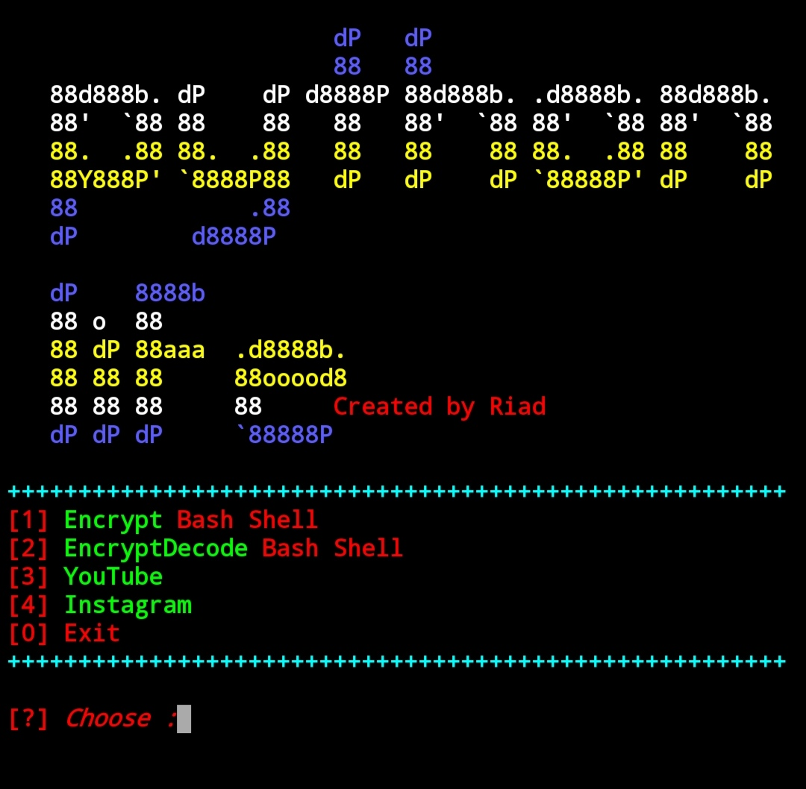

  
# bash Shell

## two in one tool Encrypt and decrypt bash shell 

## تشفير و فك تشفير ادوات الباش شال

# install in termux and kali linux

``
$ apt update && upgrade -y
``

``
$ apt install python -y;pkg install 
``

``
$ git clone https://github.com/python-life/bash.git
``

``
$ cd bash
``

``
$ python bash.py
``

## Enjoy 

## Find Me on :

